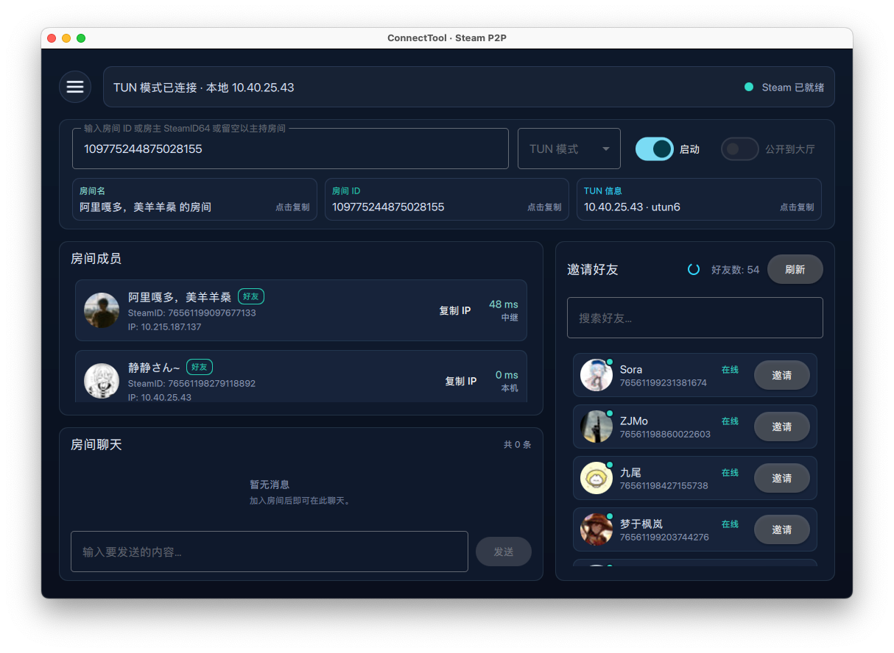

# connecttool-qt

[](https://github.com/moeleak/connecttool-qt/releases/latest)
[](https://github.com/moeleak/connecttool-qt/releases)

 使用可能会导致账号被
[ban](https://store.steampowered.com/subscriber_agreement/Steam#2)，若要使用本项目建议用小号，但
online-fix 跟本项目同原理使用 Steam 网络进行联机，从 2017 年开始传播，峰值日火
13w 仍未被 Valve 封禁。Use at your own risk!

connecttool-qt 是一款基于 connecttool
重制的图形化工具，相比主线分支优化了跨平台支持，网络性能以及拥有更好的 UI
界面，可以利用 Steam Network 进行 TCP 转发或类似 Tailscale 的异地组网效果（TUN
模式）。

## 交流群

- connecttool-qt 交流群：902943118（[点此加入](https://qm.qq.com/q/aXlMOBDbJm)）
- ConnectTool 总群：616325806（[点此加入](https://qm.qq.com/q/hgAZJYasbS)）

## 特性

- 跨平台支持良好，支持 Windows/Linux/MacOS
- 支持单一的 TCP 转发模式和跨平台 TUN 虚拟网卡模式，实现异地组网
- 房间内文字聊天，右键消息可置顶消息，让从其他地方加进来的人也可以看到房间信息快速了解房间

## connecttool-cli（服务器版）

构建后会生成 `connecttool-cli`，用于在无 GUI 的服务器上运行 ConnectTool，并提供一个轻量 Web 管理/邀请入口。

启动：

```
./connecttool-cli -c config.yaml
```

示例 `config.yaml`：

```yaml
server:
  listen: 0.0.0.0
  port: 23333
  admin_token: "change-me"
logging:
  steam_file: /var/log/connecttool-steam.log
connect:
  mode: tun        # tun 或 tcp
  room_name: "ConnectTool 房间"
  local_port: 25565
  bind_port: 8888
  publish: true
```

说明：
- Steam/SteamNet/SteamVPN 日志写入 `logging.steam_file`。
- Web server/网络日志直接输出到控制台。

Web API：

- WebUI：访问 `GET /`（导航页）或 `GET /admin/ui`（管理员界面，需要 token）。
- 访客：`GET /join/<lobbyId>` 返回加入页面，展示分享码供复制（`/invite/<lobbyId>` 仍可用作别名）。
  - 复制分享码 `￥CTJOIN:<lobbyId>￥` 后打开 ConnectTool，会自动识别并加入。
- 管理员（需要 token）：
  - `GET /admin/state` 查看当前状态。
  - `GET /admin/join` 获取当前房间与 Join 链接（`/admin/invite` 为别名）。
  - `POST /admin/config` 设置端口/模式，JSON 例：`{"localPort":25565,"localBindPort":8888,"mode":"tun"}`。
  - `POST /admin/host/start` 一键开房。
  - `POST /admin/disconnect` 断开/关房。

token 传递方式：`?token=...` 查询参数，或 `Authorization: Bearer ...` / `X-Admin-Token` 请求头。

## 待开发特性

- 开发 Android 平台

 
 

## 傻瓜式视频教程

B站[链接](https://www.bilibili.com/video/BV1geS4BUEKy)

## Windows

编译好的二进制文件在
[Release](https://github.com/moeleak/connecttool-qt/releases) 页面可以看到

## Linux/MacOS

首先安装好 `nix` 包管理器

```
$ curl -sSf -L https://install.lix.systems/lix | sh -s -- install
```

下载 [Steamworks SDK](https://partner.steamgames.com/downloads/list) ，并把
steamwebrtc 动态链接库（可从steam文件夹中搜索到，或下载
[Steamworks SDK Redist](steam://launch/1007) 放到 sdk
目录中对应的系统架构目录中。（若无需 ICE 直连功能，无需下载 steamwebrtc
动态链接库）

```
$ tree
.
├── redistributable_bin
│   ├── androidarm64
│   │   └── libsteam_api.so
│   │   └── libsteamwebrtc.so
│   ├── linux32
│   │   └── libsteam_api.so
│   │   └── libsteamwebrtc.so
│   ├── linux64
│   │   ├── libsteam_api.so
│   │   └── libsteamwebrtc.so
│   ├── linuxarm64
│   │   └── libsteam_api.so
│   │   └── libsteamwebrtc.so
│   ├── osx
│   │   ├── libsteam_api.dylib
│   │   └── libsteamwebrtc.dylib
│   ├── steam_api.dll
│   ├── steam_api.lib
│   └── win64
│       ├── steam_api64.dll
│       ├── steam_api64.lib
│       └── steamwebrtc64.dll
```

设置环境变量

```
$ export STEAMWORKS_SDK_DIR=/your/path/to/sdk
```

然后直接执行

```
$ nix run github:moeleak/connecttool-qt --impure
```

> **Apple Silicon 提示（arm64）：** Steamworks 目前只提供 x86_64 的
> `libsteamwebrtc.dylib`，要启用 ICE 直连需要在 Rosetta 下构建/运行 x86_64
> 版本。
>
> 1. 在 `/etc/nix/nix.conf` 配置
>    `extra-platforms = x86_64-darwin aarch64-darwin` 后重启 nix-daemon
>    `sudo launchctl kickstart -k system/org.nixos.nix-daemon`
> 2. 构建：`nix build .#packages.x86_64-darwin.default --impure -L`
> 3. 运行：`arch -x86_64 ./result/bin/connecttool-qt`

## Benchmark

```
connecttool-qt on  main via △ v4.1.2 via ❄️  impure (connecttool-qt-shell-env)
❯ nix run nixpkgs#iperf -- -c 10.103.59.48
Connecting to host 10.103.59.48, port 5201
[  5] local 10.40.25.43 port 54798 connected to 10.103.59.48 port 5201
[ ID] Interval           Transfer     Bitrate
[  5]   0.00-1.00   sec   896 KBytes  7.34 Mbits/sec
[  5]   1.00-2.00   sec   768 KBytes  6.26 Mbits/sec
[  5]   2.00-3.00   sec  1.00 MBytes  8.42 Mbits/sec
[  5]   3.00-4.00   sec   896 KBytes  7.33 Mbits/sec
[  5]   4.00-5.00   sec   896 KBytes  7.32 Mbits/sec
[  5]   5.00-6.00   sec   768 KBytes  6.29 Mbits/sec
[  5]   6.00-7.01   sec   896 KBytes  7.34 Mbits/sec
[  5]   7.01-8.00   sec   896 KBytes  7.37 Mbits/sec
[  5]   8.00-9.01   sec   640 KBytes  5.22 Mbits/sec
[  5]   9.01-10.00  sec   896 KBytes  7.35 Mbits/sec
- - - - - - - - - - - - - - - - - - - - - - - - -
[ ID] Interval           Transfer     Bitrate
[  5]   0.00-10.00  sec  8.38 MBytes  7.02 Mbits/sec                  sender
[  5]   0.00-10.11  sec  8.25 MBytes  6.85 Mbits/sec                  receiver

iperf Done.
```

## Star History

[](https://www.star-history.com/#moeleak/connecttool-qt&type=date&legend=top-left)
