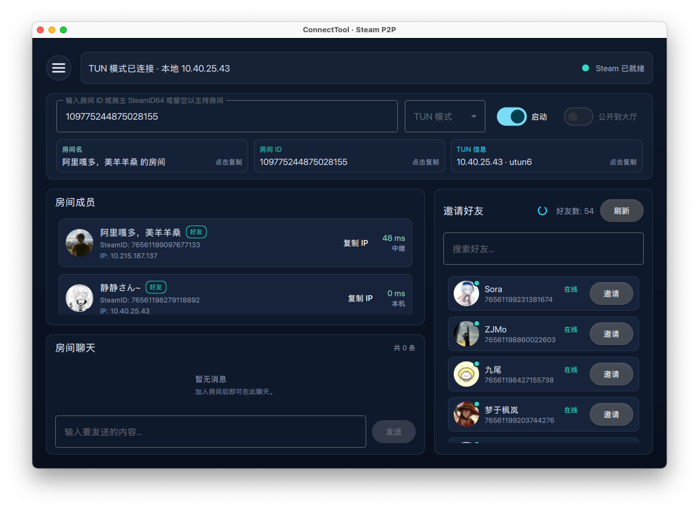

# connecttool-qt

[](https://github.com/moeleak/connecttool-qt/releases/latest)
[](https://github.com/moeleak/connecttool-qt/releases)

 使用可能会导致账号被
[ban](https://store.steampowered.com/subscriber_agreement/Steam#2)，若要使用本项目建议用小号，但
online-fix 跟本项目同原理使用 Steam 网络进行联机，从 2017 年开始传播，峰值日活
13w 仍未被 Valve 封禁。Use at your own risk!

connecttool-qt 是一款基于 connecttool
重制的图形化工具，相比主线分支优化了跨平台支持，网络性能以及拥有更好的 UI
界面，可以利用 Steam Network 进行 TCP 转发或类似 Tailscale 的异地组网效果（TUN
模式）。

## 交流群

- connecttool-qt 交流群：Discord（[点此加入](https://discord.gg/PeRutfW6NA)）
- ConnectTool 总群：616325806（[点此加入](https://qm.qq.com/q/hgAZJYasbS)）

## 特性

- 跨平台支持良好，支持 Windows/Linux/MacOS
- 基于 Qt 6.11.1 与 C++23，使用强类型 ID、安全协议编解码和结构化并发
- 使用固定版本的 QmlMaterial 构建 Material Design 3 桌面界面
- 支持单一的 TCP 转发模式和跨平台 TUN 虚拟网卡模式，实现异地组网
- 房间内文字聊天，右键消息可置顶消息，让从其他地方加进来的人也可以看到房间信息快速了解房间

代码分层、兼容性约束与验证方式见 [架构说明](docs/ARCHITECTURE.md)，性能测量方法与
本次基线见 [性能说明](docs/PERFORMANCE.md)。

项目现在按技术边界拆分：`modules/ConnectTool` 是带独立 C++ backing target 和
插件的 QML 模块；`src/network` 是不依赖 Steamworks/Qt 的网络核心；Steam SDK
适配只存在于 `src/integrations/steam`；系统相关实现统一放在 `src/platform`；
外部依赖声明和 vendored 源码集中在 `deps`。

## 开发与测试

仅构建不依赖 Steamworks 的核心协议和测试：

```sh
nix develop
cmake --preset core-tests
cmake --build --preset core-tests
ctest --preset core-tests
```

完整应用需要将 Steamworks SDK 放在 `steamworks/`、`sdk/`，或设置
`STEAMWORKS_PATH_HINT`。随后使用 `dev`/`release` 预设构建。`dev` 构建会注册
协议单元测试与离屏 QML 烟雾测试；`connecttool_ui_qmllint` 可检查应用 QML 绑定。
非 Nix 环境首次配置还需要 Git LFS，以获取 QmlMaterial 内置的 Material Symbols
字体；Nix 构建会按固定提交和哈希预取该依赖。

## 待开发特性

- 开发 Android 平台

 
 

## 傻瓜式视频教程

B站[链接](https://www.bilibili.com/video/BV1geS4BUEKy)

## Windows

编译好的二进制文件在
[Release](https://github.com/moeleak/connecttool-qt/releases) 页面可以看到

## Linux/MacOS

首先安装好 `nix` 包管理器

```
$ curl -sSf -L https://install.lix.systems/lix | sh -s -- install
```

下载 [Steamworks SDK](https://partner.steamgames.com/downloads/list) ，并把
steamwebrtc 动态链接库（可从steam文件夹中搜索到，或下载
[Steamworks SDK Redist](steam://launch/1007) 放到 sdk
目录中对应的系统架构目录中。（若无需 ICE 直连功能，无需下载 steamwebrtc
动态链接库）

```
$ tree
.
├── redistributable_bin
│   ├── androidarm64
│   │   └── libsteam_api.so
│   │   └── libsteamwebrtc.so
│   ├── linux32
│   │   └── libsteam_api.so
│   │   └── libsteamwebrtc.so
│   ├── linux64
│   │   ├── libsteam_api.so
│   │   └── libsteamwebrtc.so
│   ├── linuxarm64
│   │   └── libsteam_api.so
│   │   └── libsteamwebrtc.so
│   ├── osx
│   │   ├── libsteam_api.dylib
│   │   └── libsteamwebrtc.dylib
│   ├── steam_api.dll
│   ├── steam_api.lib
│   └── win64
│       ├── steam_api64.dll
│       ├── steam_api64.lib
│       └── steamwebrtc64.dll
```

设置环境变量

```
$ export STEAMWORKS_SDK_DIR=/your/path/to/sdk
```

然后直接执行

```
$ nix run github:moeleak/connecttool-qt --impure
```

## Linux AppImage 运行问题

在部分 Linux 发行版（如 Ubuntu / Linux Mint）上，运行 AppImage 时可能出现 Qt 版本错误：

```
libQt6Core.so.6: version `Qt_6.11' not found
```

这是由于运行时错误地加载了系统 Qt 库，而不是 AppImage 内部自带的 Qt。

### 解决方法

可以尝试使用以下方式运行：

```
LD_LIBRARY_PATH="" ./connecttool-qt-linux-x86_64.AppImage
```

或者手动解压 AppImage 后运行内部程序：

```
./connecttool-qt-linux-x86_64.AppImage --appimage-extract
cd squashfs-root
./AppRun
```

> ⚠️ 注意：该问题属于 AppImage 打包/依赖加载问题，建议后续通过修复打包流程彻底解决。


> **Apple Silicon 提示（arm64）：** Steamworks 目前只提供 x86_64 的
> `libsteamwebrtc.dylib`，要启用 ICE 直连需要在 Rosetta 下构建/运行 x86_64
> 版本。
>
> 1. 在 `/etc/nix/nix.conf` 配置
>    `extra-platforms = x86_64-darwin aarch64-darwin` 后重启 nix-daemon
>    `sudo launchctl kickstart -k system/org.nixos.nix-daemon`
> 2. 构建：`nix build .#packages.x86_64-darwin.default --impure -L`
> 3. 运行：`arch -x86_64 ./result/bin/connecttool-qt`


## Benchmark

`release` 预设会额外生成 `connecttool_protocol_benchmark`，用于在同一台机器上
比较 1200 字节数据包的编解码吞吐：

```sh
cmake --preset release
cmake --build --preset release --target connecttool_protocol_benchmark
./build/release/connecttool_protocol_benchmark
```

端到端性能仍建议使用 `iperf3`；下面保留了 1.5.x 的一次历史测量作为网络基线：

```
connecttool-qt on  main via △ v4.1.2 via ❄️  impure (connecttool-qt-shell-env)
❯ nix run nixpkgs#iperf -- -c 10.103.59.48
Connecting to host 10.103.59.48, port 5201
[  5] local 10.40.25.43 port 54798 connected to 10.103.59.48 port 5201
[ ID] Interval           Transfer     Bitrate
[  5]   0.00-1.00   sec   896 KBytes  7.34 Mbits/sec
[  5]   1.00-2.00   sec   768 KBytes  6.26 Mbits/sec
[  5]   2.00-3.00   sec  1.00 MBytes  8.42 Mbits/sec
[  5]   3.00-4.00   sec   896 KBytes  7.33 Mbits/sec
[  5]   4.00-5.00   sec   896 KBytes  7.32 Mbits/sec
[  5]   5.00-6.00   sec   768 KBytes  6.29 Mbits/sec
[  5]   6.00-7.01   sec   896 KBytes  7.34 Mbits/sec
[  5]   7.01-8.00   sec   896 KBytes  7.37 Mbits/sec
[  5]   8.00-9.01   sec   640 KBytes  5.22 Mbits/sec
[  5]   9.01-10.00  sec   896 KBytes  7.35 Mbits/sec
- - - - - - - - - - - - - - - - - - - - - - - - -
[ ID] Interval           Transfer     Bitrate
[  5]   0.00-10.00  sec  8.38 MBytes  7.02 Mbits/sec                  sender
[  5]   0.00-10.11  sec  8.25 MBytes  6.85 Mbits/sec                  receiver

iperf Done.
```

## Star History

[](https://star-history.dera.page/#moeleak/connecttool-qt&type=date&legend=top-left)
